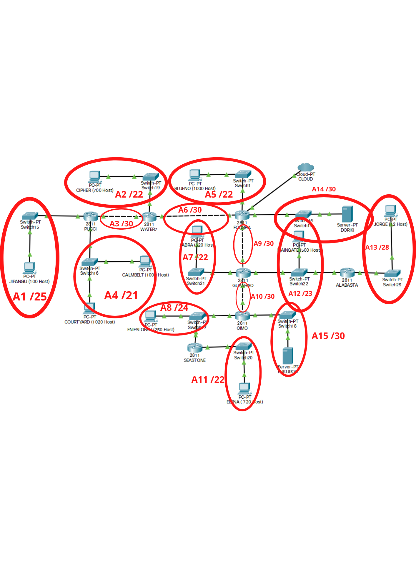
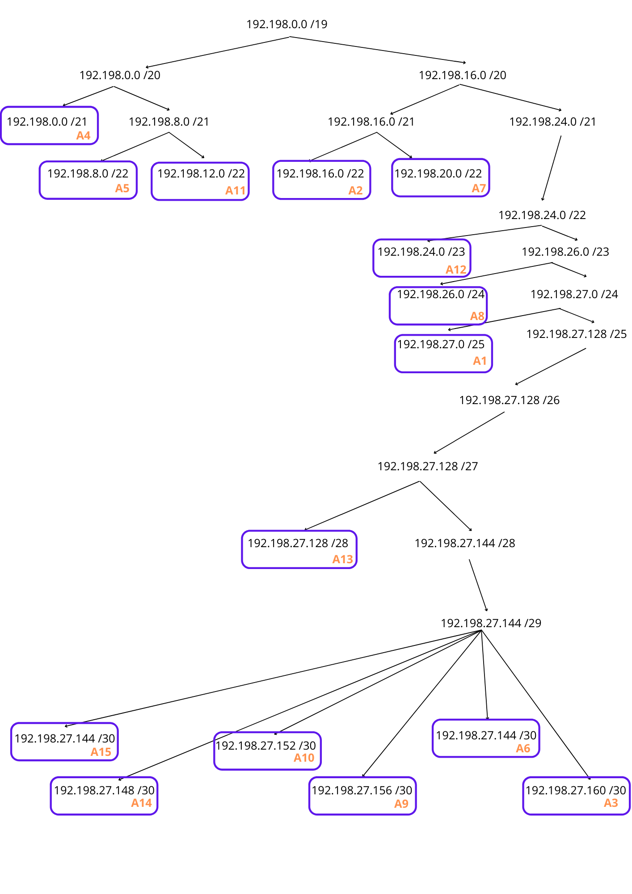

# Jarkom-Modul-4-D13-2021

### Anggota kelompok:
Anggota | NRP
------------- | -------------
Muthia Qurrota Akyun | 05111940000019
Fayha Syifa Qalbi | 05111940000185
Raihan Alifianto | 05111940000213

## Soal
Diberikan topologi sebagai berikut

Berdasarkan topologi tersebut, menerapkan subnetting pada Cisco Packet Tracer dan GNS3 menggunakan metode perhitungan CLASSLESS yang berbeda.

## Jawaban 
### CPT - Teknik VLSM (Variable Length Subnet Masking)
Membuat topologi pada CPT 

1. Membuat klasifikasi class(labelling) seperti berikut

2. Menentukan jumlah alamat IP yang dibutuhkan oleh tiap subnet dan melakukan labelling netmask berdasarkan jumlah IP yang dibutuhkan
Nama Subnet | Jumlah Host | Netmask | IP
------------- | ------------- | ------------- | -------------
A3(PUCHI + WATER7) | 2 | /30 | 192.198.27.164
A6(FOOSHA + WATER7) | 2 | /30 | 192.198.27.160
A9(FOOSHA + GUANHO) | 2 | /30 | 192.198.27.156
A10(GUANHO + OIMO) | 2 | /30 | 192.198.27.152
A14(DORIKI) | 2 | /30 | 192.198.27.148
A15(FUKUROU) | 2 | /30 | 192.198.27.144
A13(JORGE) | 13 | /28 | 192.198.27.156
A1(JIPANGU) | 101 | /25 | 192.198.27.156
A8(ENIESLOBBY) | 252 | /24 | 192.198.27.156
A12(MAINGATE) | 502 | /23 | 192.198.27.156
A7(JABRA) | 521 | /22 | 192.198.27.156
A2(CIPHER) | 701 | /22 | 192.198.27.156
A11(ELENA) | 721 | /22 | 192.198.27.156
A5(BLUENO) | 1001 | /22 | 192.198.27.156
A4(COURYARD + CAMBELT) | 2021 | /21 | 192.198.27.156
Total | 5845 | /19 | -

Menghitung pembagian IP berdasarkan NID dan netmask

### GNS3 - Teknik CIDR (Classless Inter Domain Routing)
Membuat topologi pada GNS3

## Kendala
